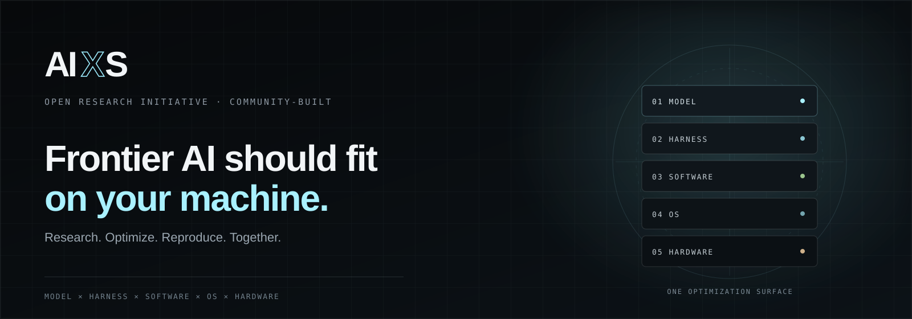

<p align="center">
  
</p>

<p align="center"><strong>Artificial Intelligence, Accessible.</strong></p>

<p align="center">
  <a href="../../missions/mission-01/README.md"><strong>Esplora Mission 01</strong></a> ·
  <a href="../research-map.md">Mappa della ricerca</a> ·
  <a href="../../CONTRIBUTING.md">Contribuisci</a> ·
  <a href="https://github.com/FabbriMatteo6/AIXS/discussions">Partecipa alla discussione</a> ·
  <a href="../../README.md">English</a>
</p>

---

## L'AI di frontiera dovrebbe stare sulla tua macchina.

**AIXS** è un'iniziativa di ricerca aperta e guidata dalla community che studia come rendere modelli AI di classe frontier utilizzabili localmente su hardware consumer accessibile, preservando il più possibile l'intelligenza e le prestazioni del modello originale.

La tesi centrale è semplice: il collo di bottiglia non appartiene a un solo livello. **Architettura del modello, orchestrazione, runtime, sistema operativo, movimento della memoria e hardware sono vincoli interdipendenti.** AIXS li tratta come un'unica superficie di ottimizzazione.

Oggi il percorso dominante è:

```text
Modello frontier → grande datacenter → API → utente
```

AIXS studia un percorso diverso:

```text
Modello → Harness → Software → OS → Hardware → la tua macchina
```

Questo repository è il monorepo principale della ricerca AIXS. Contiene missioni, esperimenti, ricerca e codice dei cinque pilastri, metadati di riproducibilità, profili hardware, benchmark, integrazioni e il sito pubblico.

> **Non è un prodotto finito. Non è una promessa di benchmark. È una sfida di ricerca da affrontare insieme.**

## Cinque pilastri interdipendenti

| Pilastro | Domanda | Area di lavoro |
| --- | --- | --- |
| **1. Model** | Cosa possiamo cambiare in architettura, quantizzazione, sparsità, expert sharing e caricamento senza perdere le capacità che ci interessano? | [`research/model/`](../../research/model/) |
| **2. Harness / Orchestration** | Come possono routing, cache, contesto, batching, speculative methods e scheduling ridurre lavoro sprecato attorno al modello? | [`research/harness/`](../../research/harness/) |
| **3. Software / Runtime** | Come devono kernel, paging, formati, prefetch e distribuzione dell'esecuzione muovere pesi e calcolo? | [`research/software/`](../../research/software/) |
| **4. OS / System Layer** | Possiamo gestire memoria, I/O, scheduling, potenza e topologia in modo più intelligente per l'AI locale? | [`research/os/`](../../research/os/) |
| **5. Hardware** | Fino a dove possiamo spingere GPU consumer, Apple Silicon, sistemi eterogenei e design memory-centric? | [`research/hardware/`](../../research/hardware/) |

I pilastri sono **aree di conoscenza e ownership**. Le unità di esecuzione vere e proprie sono le **missioni**.

## Mission 01 — Establish the Baseline

Prima di cercare un breakthrough, serve un punto di partenza difficilmente contestabile.

Mission 01 selezionerà un modello Mixture-of-Experts open-weight di classe frontier e un insieme di hardware di riferimento chiaramente definito, documenterà il comportamento hosted/reference, eseguirà la migliore baseline locale pratica e pubblicherà misure riproducibili.

Il modello e l'hardware di riferimento sono **deliberatamente ancora da scegliere**. La loro selezione fa parte della ricerca.

### Criteri di uscita

- [ ] Selezionare e documentare il modello candidato usando criteri espliciti.
- [ ] Selezionare un insieme hardware di riferimento mantenendo comunque macchine esplorative eterogenee.
- [ ] Definire controlli di qualità e comportamento di riferimento.
- [ ] Riprodurre la migliore baseline locale pratica.
- [ ] Misurare qualità, TTFT, token/sec, memoria, I/O storage ed energia dove possibile.
- [ ] Testare ottimizzazioni un'ipotesi alla volta con evidenze before/after.
- [ ] Pubblicare metodo, risultati, fallimenti e una demo/report riproducibile.

Punto di partenza: **[`missions/mission-01/`](../../missions/mission-01/)**.

## Come funziona AIXS

AIXS separa tre concetti che spesso vengono mescolati:

- **Missioni** — definiscono cosa la community sta cercando di ottenere adesso.
- **Pilastri di ricerca** — accumulano ipotesi, codice, conoscenza e problemi aperti per ogni livello del sistema.
- **Esperimenti** — sono l'evidenza: una registrazione riproducibile di cosa è stato testato, dove e con quale risultato.

Un esperimento valido **non deve avere per forza un risultato positivo**. Risultati negativi, falliti e inconcludenti sono contributi di prima classe quando sono riproducibili e documentati chiaramente.

### Stati degli esperimenti

| Stato | Significato |
| --- | --- |
| `planned` | Ipotesi e metodo sono definiti, ma l'esecuzione non è iniziata. |
| `running` | I dati vengono raccolti o il risultato viene riprodotto. |
| `completed` | L'esperimento pianificato è terminato e l'evidenza è stata registrata. |
| `failed` | L'approccio testato non ha funzionato come previsto. È comunque un risultato negativo valido. |
| `inconclusive` | L'evidenza è insufficiente o contraddittoria; non viene dichiarata una conclusione. |
| `superseded` | Un esperimento più recente lo sostituisce mantenendo intatto lo storico. |

Lo schema canonico parte da **`schema_version: "0.1"`** ed è versionato intenzionalmente, così la metodologia può evolvere senza riscrivere la storia.

Consulta [`experiments/README.md`](../../experiments/README.md) e [`docs/methodology.md`](../methodology.md).

## Riproducibilità prima della retorica

AIXS privilegia evidenze misurate rispetto a stime quando la misura è praticabile. Un esperimento dovrebbe permettere a un altro contributor di capire:

1. quale hardware e sistema operativo sono stati usati;
2. quali pesi, revisione e quantizzazione del modello sono stati testati;
3. quale runtime/repository upstream e quale commit sono stati usati;
4. workload, prompt, contesto e impostazioni;
5. controlli di qualità/correttezza;
6. TTFT e throughput di generazione;
7. footprint RAM/VRAM/storage e I/O dove rilevante;
8. misure di energia/potenza dove possibili;
9. cosa è cambiato rispetto alla baseline;
10. cosa è fallito, cosa ci ha sorpreso e cosa resta incerto.

Pesi dei modelli, trace e dataset grandi devono restare fuori da Git. Nel repository conserviamo **il contratto di riproducibilità**: configurazioni, piccoli risultati, hash, revisioni esatte, sintesi e link agli artefatti esterni.

## Mappa del repository

```text
AIXS/
├── apps/website/             # Sito pubblico AIXS
├── missions/                 # Unità di esecuzione e obiettivi attivi
│   └── mission-01/
├── research/                 # Conoscenza dei pilastri + codice iniziale
│   ├── model/
│   ├── harness/
│   ├── software/
│   ├── os/
│   └── hardware/
├── experiments/              # Archivio sperimentale riproducibile
│   ├── schema/
│   ├── templates/
│   └── mission-01/
├── registry/hardware/        # Profili di macchine eterogenee
├── benchmarks/               # Workload e metodi di qualità condivisi
├── adapters/                 # Integrazioni AIXS con progetti upstream
├── patches/                  # Patch revisionabili su revisioni upstream fissate
├── tools/                    # Tool condivisi di repository/ricerca
├── docs/                     # Architettura, metodologia e research map
└── .github/                  # Template lean + CI
```

Vedi [`docs/architecture.md`](../architecture.md) per le regole di design della struttura.

## Contribuire

Non serve arrivare con una nuova architettura o un paper.

Sono contributi utili:

- riprodurre un risultato su una macchina;
- registrare un profilo hardware;
- testare un'ipotesi di quantizzazione, routing, paging o scheduling;
- implementare un adapter o una patch piccola su una revisione upstream precisa;
- migliorare un benchmark o un quality check;
- documentare un risultato negativo;
- revisionare un esperimento dal punto di vista della riproducibilità;
- mappare ricerca pubblica rilevante.

Inizia da [`CONTRIBUTING.md`](../../CONTRIBUTING.md). Per domande di ricerca e idee usa **GitHub Discussions**. Per lavoro concreto usa **Issues** e **Pull Requests**.

## Cosa AIXS è — e cosa non è

| AIXS è | AIXS non è |
| --- | --- |
| Ricerca open ed evidence-first sui sistemi | La dichiarazione che l'AI frontier funzioni già perfettamente su hardware economico |
| Community-led e orientata alla riproducibilità | Un repository centrato su un fondatore |
| Disposta a pubblicare risultati falliti e negativi | Una leaderboard senza metodologia |
| Aperta a ricercatori esperti e beginner motivati | La promessa che ogni componente futuro avrà la stessa licenza o modello di business |

## Sito

Il sito pubblico è **in arrivo**. Il codice vive in [`apps/website/`](../../apps/website/).

## Licenza e attribuzione

Il codice e il materiale originale AIXS sono rilasciati sotto **Apache License 2.0**, salvo indicazione diversa nei singoli file o componenti importati. Progetti, paper e patch di terze parti mantengono le proprie licenze e requisiti di attribuzione.

Consulta [`LICENSE`](../../LICENSE) e [`CITATION.cff`](../../CITATION.cff).

---

<p align="center"><strong>AIXS — Artificial Intelligence, Accessible.</strong></p>
